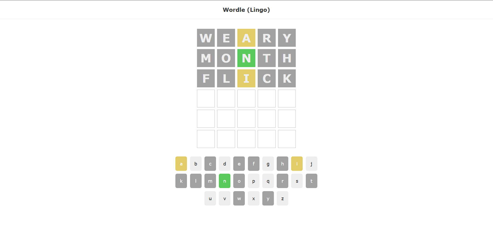

# React Wordle

Wordle Implemented with React.js

## Available Scripts

In the project directory, you can run:

### `npm run start`

Runs the app in the development mode.\
Open [http://localhost:3000](http://localhost:3000) to view it in your browser.

The page will reload when you make changes.\
You may also see any lint errors in the console.

### `npm run start-json`

Runs the JSON server in which the words are located.
Open [http://localhost:3001/letters](http://localhost:3001/letters) to view letters in your browser.
Open [http://localhost:3001/solutions](http://localhost:3001/solutions) to view it in your browser.

### `YOU MUST FIRST RUN THE JSON SERVER AND THEN THE APPLICATION IN ORDER TO RECEIVE THE WORDS FROM THE SERVER`

## Used Tool
&nbsp;React.js -- A Javascript library that is used for building User Interfaces.  

## Screenshots
</img>
